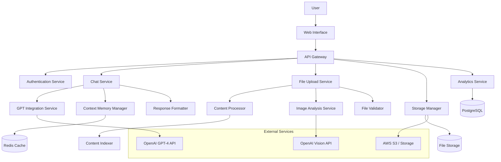
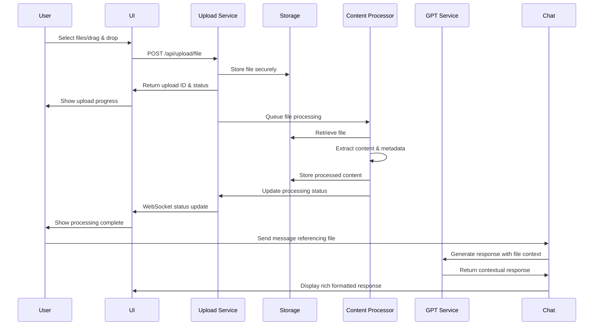

# Design Document

## Overview

The Custom GPT Assistant is a microservices-based application that combines advanced GPT-powered natural language processing with file upload capabilities, content analysis, and context memory management. The system processes user queries, analyzes uploaded files and images, maintains conversation context, and delivers rich formatted responses with integrated content references.

## Architecture

### High-Level Architecture



### Technology Stack

- **Backend**: Node.js with Fastify framework for high performance
- **Frontend**: React with TypeScript for rich file upload UI
- **Database**: PostgreSQL for user data and analytics, Redis for caching and sessions
- **File Storage**: AWS S3 or compatible object storage with CDN
- **Authentication**: JWT tokens with refresh token rotation
- **Message Queue**: Bull Queue with Redis for async file processing
- **Search/Indexing**: Elasticsearch for content search and retrieval
- **Monitoring**: Prometheus + Grafana for metrics, structured logging
- **Deployment**: Docker containers with Kubernetes orchestration
- **CI/CD**: GitHub Actions with automated testing and deployment

## Components and Interfaces

### 1. Chat Service

**Responsibilities:**
- WebSocket connection management for real-time chat
- Message validation and sanitization
- Conversation context management
- Integration with GPT and content processing services

**API Endpoints:**
```typescript
POST /api/chat/message
WebSocket /ws/chat
GET /api/chat/history/:sessionId
POST /api/chat/upload
GET /api/chat/context/:sessionId
```

**Key Interfaces:**
```typescript
interface ChatMessage {
  id: string;
  sessionId: string;
  userId?: string;
  message: string;
  timestamp: Date;
  type: 'user' | 'assistant' | 'system' | 'file_upload';
  attachments?: FileAttachment[];
  context?: ContentContext[];
}

interface ChatResponse {
  id: string;
  message: string;
  formatted: boolean;
  references?: ContentReference[];
  suggestions?: string[];
  streaming?: boolean;
  error?: string;
}

interface FileAttachment {
  id: string;
  filename: string;
  type: string;
  size: number;
  url: string;
  processed: boolean;
}
```

### 2. File Upload Service

**Responsibilities:**
- Multi-format file upload handling (docs, CSVs, JSONs, images)
- File validation and security scanning
- Async processing coordination
- Upload progress tracking

**API Endpoints:**
```typescript
POST /api/upload/file
POST /api/upload/multiple
GET /api/upload/status/:uploadId
DELETE /api/upload/:fileId
```

**Key Interfaces:**
```typescript
interface FileUploadRequest {
  files: File[];
  sessionId: string;
  userId?: string;
  metadata?: Record<string, any>;
}

interface FileUploadResponse {
  uploadId: string;
  files: UploadedFile[];
  status: 'pending' | 'processing' | 'completed' | 'failed';
  progress: number;
}

interface UploadedFile {
  id: string;
  filename: string;
  originalName: string;
  mimeType: string;
  size: number;
  url: string;
  thumbnailUrl?: string;
  processed: boolean;
  extractedContent?: string;
  metadata?: Record<string, any>;
}
```

### 3. Content Processor Service

**Responsibilities:**
- Text extraction from various document formats
- Content parsing and structuring
- Metadata extraction and indexing
- Content chunking for GPT context

**Supported Formats:**
```typescript
interface SupportedFormats {
  documents: ['pdf', 'docx', 'txt', 'md', 'rtf'];
  spreadsheets: ['xlsx', 'csv', 'tsv'];
  data: ['json', 'xml', 'yaml'];
  images: ['jpg', 'png', 'gif', 'webp', 'svg'];
  code: ['js', 'ts', 'py', 'java', 'cpp', 'html', 'css'];
}

interface ContentExtractionResult {
  fileId: string;
  extractedText: string;
  structure: ContentStructure;
  metadata: FileMetadata;
  chunks: ContentChunk[];
  embeddings?: number[][];
}

interface ContentChunk {
  id: string;
  content: string;
  type: 'paragraph' | 'table' | 'list' | 'code' | 'header';
  position: number;
  tokens: number;
  embedding?: number[];
}
```

### 4. GPT Integration Service

**Responsibilities:**
- OpenAI GPT-4 API integration with context management
- Prompt engineering and optimization
- Response streaming and formatting
- Context window management and chunking

**OpenAI Integration:**
```typescript
interface GPTRequest {
  messages: GPTMessage[];
  context: ContentContext[];
  sessionId: string;
  streaming?: boolean;
  maxTokens?: number;
  temperature?: number;
}

interface GPTMessage {
  role: 'system' | 'user' | 'assistant';
  content: string;
  attachments?: ContentReference[];
}

interface ContentContext {
  source: 'file' | 'conversation' | 'system';
  content: string;
  metadata: {
    filename?: string;
    type?: string;
    relevance?: number;
    timestamp?: Date;
  };
}

interface GPTResponse {
  id: string;
  content: string;
  usage: {
    promptTokens: number;
    completionTokens: number;
    totalTokens: number;
  };
  references: ContentReference[];
  streaming: boolean;
}
```

### 5. Image Analysis Service

**Responsibilities:**
- Image content extraction using OpenAI Vision API
- OCR for text extraction from images
- Image metadata analysis
- Thumbnail generation

**Vision API Integration:**
```typescript
interface ImageAnalysisRequest {
  imageUrl: string;
  analysisType: 'describe' | 'ocr' | 'extract_text' | 'analyze_chart';
  detail?: 'low' | 'high';
}

interface ImageAnalysisResult {
  fileId: string;
  description: string;
  extractedText?: string;
  objects?: DetectedObject[];
  metadata: ImageMetadata;
  thumbnail: string;
}

interface DetectedObject {
  label: string;
  confidence: number;
  boundingBox?: BoundingBox;
}
```

### 6. Context Memory Manager

**Responsibilities:**
- Conversation context persistence
- File-based knowledge management
- Context retrieval and ranking
- Memory optimization and cleanup

**Context Management:**
```typescript
interface ContextManager {
  storeContext(sessionId: string, context: ConversationContext): Promise<void>;
  retrieveContext(sessionId: string, query?: string): Promise<ConversationContext>;
  addFileContext(sessionId: string, fileId: string, content: ContentChunk[]): Promise<void>;
  searchContext(sessionId: string, query: string): Promise<ContentReference[]>;
}

interface ConversationContext {
  sessionId: string;
  messages: ChatMessage[];
  fileReferences: FileReference[];
  lastActivity: Date;
  totalTokens: number;
}
```

## Data Models

### Core Data Structures

```typescript
interface User {
  id: string;
  email?: string;
  username?: string;
  createdAt: Date;
  lastActive: Date;
  storageQuota: number;
  storageUsed: number;
  preferences: UserPreferences;
}

interface UserPreferences {
  language: string;
  theme: 'light' | 'dark';
  responseFormat: 'markdown' | 'html' | 'plain';
  maxFileSize: number;
  autoProcessFiles: boolean;
}

interface ChatSession {
  id: string;
  userId?: string;
  title?: string;
  startTime: Date;
  lastActivity: Date;
  messageCount: number;
  fileCount: number;
  totalTokens: number;
  context: ConversationContext;
}

interface FileRecord {
  id: string;
  userId?: string;
  sessionId: string;
  filename: string;
  originalName: string;
  mimeType: string;
  size: number;
  storageUrl: string;
  thumbnailUrl?: string;
  uploadedAt: Date;
  processedAt?: Date;
  status: 'uploaded' | 'processing' | 'processed' | 'failed';
  extractedContent?: string;
  metadata: FileMetadata;
  chunks: ContentChunk[];
}

interface ContentReference {
  fileId: string;
  filename: string;
  chunkId?: string;
  content: string;
  relevance: number;
  type: 'text' | 'table' | 'image' | 'code';
  position?: number;
}

interface AnalyticsEvent {
  id: string;
  sessionId: string;
  userId?: string;
  type: 'message' | 'upload' | 'download' | 'error' | 'feedback';
  timestamp: Date;
  data: Record<string, any>;
  metadata?: Record<string, any>;
}
```

### Database Schema

```sql
-- User management
CREATE TABLE users (
  id UUID PRIMARY KEY DEFAULT gen_random_uuid(),
  email VARCHAR(255) UNIQUE,
  username VARCHAR(100),
  created_at TIMESTAMP DEFAULT NOW(),
  last_active TIMESTAMP DEFAULT NOW(),
  storage_quota BIGINT DEFAULT 1073741824, -- 1GB default
  storage_used BIGINT DEFAULT 0,
  preferences JSONB DEFAULT '{}',
  is_active BOOLEAN DEFAULT true
);

-- Chat sessions
CREATE TABLE chat_sessions (
  id UUID PRIMARY KEY DEFAULT gen_random_uuid(),
  user_id UUID REFERENCES users(id) ON DELETE CASCADE,
  title VARCHAR(255),
  start_time TIMESTAMP DEFAULT NOW(),
  last_activity TIMESTAMP DEFAULT NOW(),
  message_count INTEGER DEFAULT 0,
  file_count INTEGER DEFAULT 0,
  total_tokens INTEGER DEFAULT 0,
  context JSONB DEFAULT '{}',
  created_at TIMESTAMP DEFAULT NOW()
);

-- File records
CREATE TABLE files (
  id UUID PRIMARY KEY DEFAULT gen_random_uuid(),
  user_id UUID REFERENCES users(id) ON DELETE CASCADE,
  session_id UUID REFERENCES chat_sessions(id) ON DELETE CASCADE,
  filename VARCHAR(255) NOT NULL,
  original_name VARCHAR(255) NOT NULL,
  mime_type VARCHAR(100) NOT NULL,
  size BIGINT NOT NULL,
  storage_url TEXT NOT NULL,
  thumbnail_url TEXT,
  uploaded_at TIMESTAMP DEFAULT NOW(),
  processed_at TIMESTAMP,
  status VARCHAR(20) DEFAULT 'uploaded',
  extracted_content TEXT,
  metadata JSONB DEFAULT '{}',
  created_at TIMESTAMP DEFAULT NOW()
);

-- Content chunks for efficient retrieval
CREATE TABLE content_chunks (
  id UUID PRIMARY KEY DEFAULT gen_random_uuid(),
  file_id UUID REFERENCES files(id) ON DELETE CASCADE,
  content TEXT NOT NULL,
  chunk_type VARCHAR(50) NOT NULL,
  position INTEGER NOT NULL,
  tokens INTEGER NOT NULL,
  embedding VECTOR(1536), -- OpenAI embedding dimension
  metadata JSONB DEFAULT '{}',
  created_at TIMESTAMP DEFAULT NOW()
);

-- Chat messages
CREATE TABLE chat_messages (
  id UUID PRIMARY KEY DEFAULT gen_random_uuid(),
  session_id UUID REFERENCES chat_sessions(id) ON DELETE CASCADE,
  user_id UUID REFERENCES users(id) ON DELETE SET NULL,
  role VARCHAR(20) NOT NULL,
  content TEXT NOT NULL,
  attachments JSONB DEFAULT '[]',
  context_refs JSONB DEFAULT '[]',
  timestamp TIMESTAMP DEFAULT NOW(),
  tokens INTEGER DEFAULT 0,
  created_at TIMESTAMP DEFAULT NOW()
);

-- Analytics and events
CREATE TABLE analytics_events (
  id UUID PRIMARY KEY DEFAULT gen_random_uuid(),
  session_id UUID REFERENCES chat_sessions(id) ON DELETE SET NULL,
  user_id UUID REFERENCES users(id) ON DELETE SET NULL,
  event_type VARCHAR(50) NOT NULL,
  timestamp TIMESTAMP DEFAULT NOW(),
  data JSONB DEFAULT '{}',
  metadata JSONB DEFAULT '{}',
  created_at TIMESTAMP DEFAULT NOW()
);

-- Performance indexes
CREATE INDEX idx_users_email ON users(email);
CREATE INDEX idx_sessions_user_id ON chat_sessions(user_id);
CREATE INDEX idx_sessions_last_activity ON chat_sessions(last_activity);
CREATE INDEX idx_files_user_id ON files(user_id);
CREATE INDEX idx_files_session_id ON files(session_id);
CREATE INDEX idx_files_status ON files(status);
CREATE INDEX idx_chunks_file_id ON content_chunks(file_id);
CREATE INDEX idx_messages_session_id ON chat_messages(session_id);
CREATE INDEX idx_messages_timestamp ON chat_messages(timestamp);
CREATE INDEX idx_events_session_id ON analytics_events(session_id);
CREATE INDEX idx_events_type_timestamp ON analytics_events(event_type, timestamp);

-- Vector similarity search index (for pgvector extension)
CREATE INDEX idx_chunks_embedding ON content_chunks USING ivfflat (embedding vector_cosine_ops);
```

## File Upload Flow and Processing

### Upload Workflow



### UX and UI Design Notes

**File Upload Interface:**
- Drag-and-drop zone with visual feedback
- Multi-file selection with progress indicators
- File type icons and size validation
- Preview thumbnails for images and documents
- Real-time processing status updates

**Chat Interface Enhancements:**
- File attachment indicators in message bubbles
- Expandable file previews within chat
- Context highlighting when files are referenced
- Rich formatting for tables, code, and structured data
- Streaming response indicators for long GPT responses

**File Management:**
- Session-based file organization
- File search and filtering capabilities
- Storage quota indicators and management
- File sharing and export options

## Error Handling

### Error Classification and Response Strategy

```typescript
enum ErrorType {
  VALIDATION_ERROR = 'VALIDATION_ERROR',
  FILE_TOO_LARGE = 'FILE_TOO_LARGE',
  UNSUPPORTED_FORMAT = 'UNSUPPORTED_FORMAT',
  PROCESSING_FAILED = 'PROCESSING_FAILED',
  STORAGE_ERROR = 'STORAGE_ERROR',
  GPT_API_ERROR = 'GPT_API_ERROR',
  QUOTA_EXCEEDED = 'QUOTA_EXCEEDED',
  AUTHENTICATION_ERROR = 'AUTHENTICATION_ERROR',
  INTERNAL_ERROR = 'INTERNAL_ERROR'
}

interface ErrorResponse {
  error: {
    type: ErrorType;
    message: string;
    code: string;
    retryAfter?: number;
    suggestions?: string[];
    context?: Record<string, any>;
  };
  requestId: string;
  timestamp: Date;
}
```

### Retry Logic and Circuit Breaker

```typescript
interface RetryConfig {
  maxAttempts: 3;
  baseDelay: 1000; // ms
  maxDelay: 10000; // ms
  backoffMultiplier: 2;
  jitter: true;
}

interface CircuitBreakerConfig {
  failureThreshold: 5;
  resetTimeout: 60000; // ms
  monitoringPeriod: 30000; // ms
}
```

### Graceful Degradation

1. **API Failures**: Serve cached results with appropriate messaging
2. **Affiliate Link Failures**: Use original URLs with revenue tracking disabled
3. **Image Loading Failures**: Display placeholder images with retry mechanism
4. **GPT API Failures**: Fall back to keyword-based search with predefined patterns

## Caching Strategy

### Redis Cache Configuration

```typescript
interface CacheConfig {
  processedContent: {
    ttl: 86400; // 24 hours
    maxSize: '1GB';
  };
  gptResponses: {
    ttl: 3600; // 1 hour
    maxSize: '500MB';
  };
  fileMetadata: {
    ttl: 604800; // 7 days
    maxSize: '200MB';
  };
  userSessions: {
    ttl: 1800; // 30 minutes
    maxSize: '100MB';
  };
  contextEmbeddings: {
    ttl: 172800; // 48 hours
    maxSize: '2GB';
  };
}
```

### Cache Key Strategy

```typescript
const cacheKeys = {
  processedContent: (fileId: string) => 
    `content:${fileId}`,
  gptResponse: (prompt: string, context: string) => 
    `gpt:${hashContent(prompt, context)}`,
  fileMetadata: (fileId: string) => 
    `metadata:${fileId}`,
  userSession: (sessionId: string) => 
    `session:${sessionId}`,
  contextEmbedding: (chunkId: string) => 
    `embedding:${chunkId}`
};
```

## Optimization and Scalability

### Performance Optimizations

**File Processing:**
- Parallel processing for multiple file uploads
- Chunked processing for large files to prevent memory issues
- Background processing with job queues
- Content deduplication to avoid reprocessing identical files

**GPT Integration:**
- Response streaming for better user experience
- Context window optimization and intelligent chunking
- Prompt caching for similar queries
- Token usage optimization and monitoring

**Storage Efficiency:**
- File compression for text-based documents
- CDN integration for fast file retrieval
- Automatic cleanup of expired files
- Tiered storage (hot/warm/cold) based on access patterns

### Cost Optimization Strategies

```typescript
interface CostOptimization {
  gptUsage: {
    contextWindowManagement: 'intelligent_chunking';
    responseStreaming: true;
    promptCaching: true;
    tokenBudgeting: 'per_user_limits';
  };
  storage: {
    compressionEnabled: true;
    tieringStrategy: 'access_based';
    retentionPolicies: 'configurable_per_user';
    deduplication: true;
  };
  processing: {
    batchProcessing: true;
    resourcePooling: true;
    autoScaling: 'demand_based';
  };
}
```

### Scalability Considerations

**Horizontal Scaling:**
- Stateless service design for easy replication
- Database read replicas for improved performance
- Message queue clustering for high throughput
- CDN integration for global file access

**Resource Management:**
- Auto-scaling based on CPU and memory usage
- Connection pooling for database and external APIs
- Circuit breakers for external service failures
- Rate limiting per user and globally

## API Rate Limiting and Quotas

### AliExpress API Limits

```typescript
interface APILimits {
  aliexpress: {
    searchAPI: {
      requestsPerSecond: 10;
      requestsPerDay: 10000;
      burstLimit: 50;
    };
    affiliateAPI: {
      requestsPerSecond: 5;
      requestsPerDay: 5000;
      burstLimit: 25;
    };
  };
  openai: {
    requestsPerMinute: 3000;
    tokensPerMinute: 250000;
  };
}
```

### Rate Limiting Implementation

```typescript
interface RateLimiter {
  checkLimit(service: string, endpoint: string): Promise<boolean>;
  getRemainingQuota(service: string): Promise<number>;
  getResetTime(service: string): Promise<Date>;
}
```

## Security Considerations

### API Key Management

```typescript
interface SecurityConfig {
  apiKeys: {
    rotation: 'monthly';
    storage: 'environment_variables';
    encryption: 'AES-256-GCM';
  };
  authentication: {
    jwtSecret: string;
    tokenExpiry: '24h';
    refreshTokenExpiry: '7d';
  };
  rateLimiting: {
    windowMs: 900000; // 15 minutes
    maxRequests: 100;
    skipSuccessfulRequests: false;
  };
}
```

### Input Validation and Sanitization

```typescript
interface ValidationRules {
  chatMessage: {
    maxLength: 1000;
    allowedCharacters: /^[\w\s\-.,!?()]+$/;
    sanitization: 'html_escape';
  };
  searchQuery: {
    maxLength: 200;
    minLength: 2;
    blacklistedTerms: string[];
  };
}
```

## Testing Strategy

### Test Coverage Requirements

1. **Unit Tests**: 90% coverage for business logic
2. **Integration Tests**: API endpoint testing with mocked external services
3. **End-to-End Tests**: Complete user journey automation
4. **Performance Tests**: Load testing for concurrent users
5. **Security Tests**: Penetration testing and vulnerability scanning

### Test Environment Setup

```typescript
interface TestConfig {
  mockServices: {
    aliexpressAPI: 'wiremock';
    openaiAPI: 'custom_mock';
    redis: 'redis-memory-server';
    postgres: 'testcontainers';
  };
  testData: {
    sampleProducts: 'fixtures/products.json';
    searchQueries: 'fixtures/queries.json';
    userSessions: 'fixtures/sessions.json';
  };
}
```

### Performance Benchmarks

```typescript
interface PerformanceBenchmarks {
  responseTime: {
    p50: 200; // ms
    p95: 500; // ms
    p99: 1000; // ms
  };
  throughput: {
    searchesPerSecond: 100;
    concurrentUsers: 1000;
  };
  availability: {
    uptime: 99.9; // %
    errorRate: 0.1; // %
  };
}
```

## Monitoring and Observability

### Metrics Collection

```typescript
interface MetricsConfig {
  business: {
    searchVolume: 'counter';
    conversionRate: 'gauge';
    revenuePerSession: 'histogram';
    popularProducts: 'top_k';
  };
  technical: {
    apiResponseTime: 'histogram';
    cacheHitRate: 'gauge';
    errorRate: 'counter';
    queueDepth: 'gauge';
  };
}
```

### Alerting Rules

```yaml
alerts:
  - name: HighErrorRate
    condition: error_rate > 5%
    duration: 5m
    severity: critical
    
  - name: SlowAPIResponse
    condition: p95_response_time > 1000ms
    duration: 2m
    severity: warning
    
  - name: LowCacheHitRate
    condition: cache_hit_rate < 70%
    duration: 10m
    severity: warning
```

## Deployment Architecture

### Container Configuration

```dockerfile
# Multi-stage build for production optimization
FROM node:18-alpine AS builder
WORKDIR /app
COPY package*.json ./
RUN npm ci --only=production

FROM node:18-alpine AS runtime
WORKDIR /app
COPY --from=builder /app/node_modules ./node_modules
COPY . .
EXPOSE 3000
CMD ["npm", "start"]
```

### Kubernetes Deployment

```yaml
apiVersion: apps/v1
kind: Deployment
metadata:
  name: aliexpress-chat-api
spec:
  replicas: 3
  selector:
    matchLabels:
      app: aliexpress-chat-api
  template:
    metadata:
      labels:
        app: aliexpress-chat-api
    spec:
      containers:
      - name: api
        image: aliexpress-chat:latest
        ports:
        - containerPort: 3000
        env:
        - name: REDIS_URL
          valueFrom:
            secretKeyRef:
              name: redis-secret
              key: url
        resources:
          requests:
            memory: "256Mi"
            cpu: "250m"
          limits:
            memory: "512Mi"
            cpu: "500m"
```